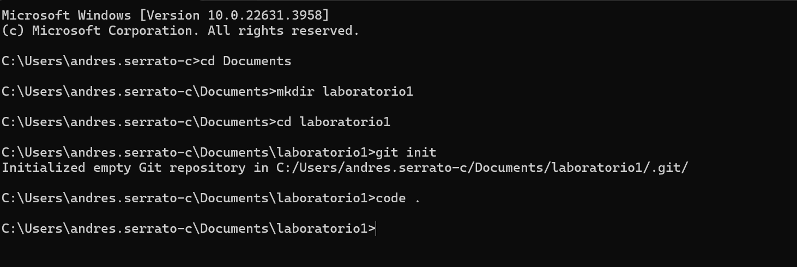
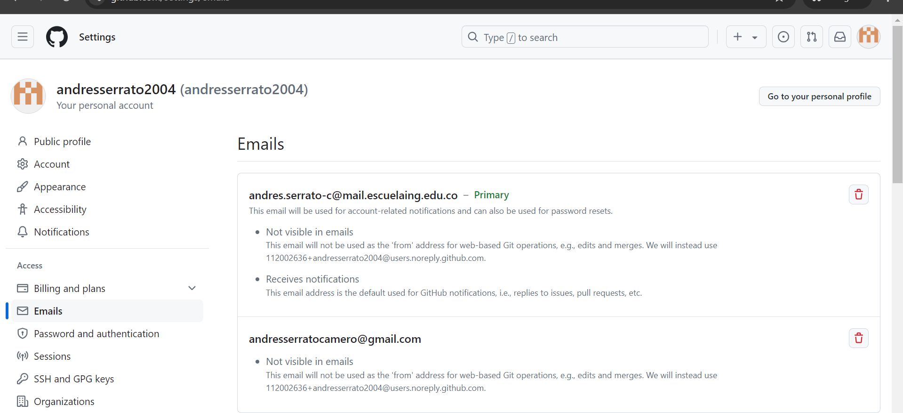
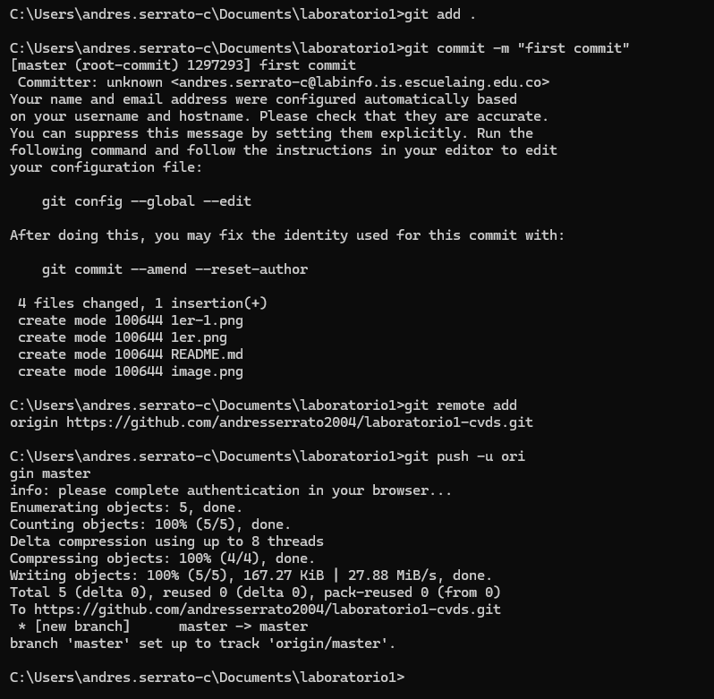

# laboratorio  1 -ciclos de vida
## Andres Serrato

readme de laboratorio 1 de ciclos

### Averigua para qué sirve y como se usan estos comandos git add y git commit -m “mensaje”

el comando git add  se utiliza para agregar cambios en archivos al area de preparacion de Git esto va justo antes de hacer el git commit  

el comando git commit -m "mensaje" se usa para guardar los cambios que has agregado al área de preparación en el historial del repositorio. El -m "mensaje" permite incluir un mensaje que describe los cambios realizados en ese commit 

### Resumen:
git add: Mueve los cambios de tus archivos al área de preparación, preparándolos para el próximo commit.
git commit -m "mensaje": Guarda los cambios en el historial del repositorio con un mensaje descriptivo.

## Configura el repositorio local con el repositorio remoto.

## Configura el correo en git local de manera correcta

